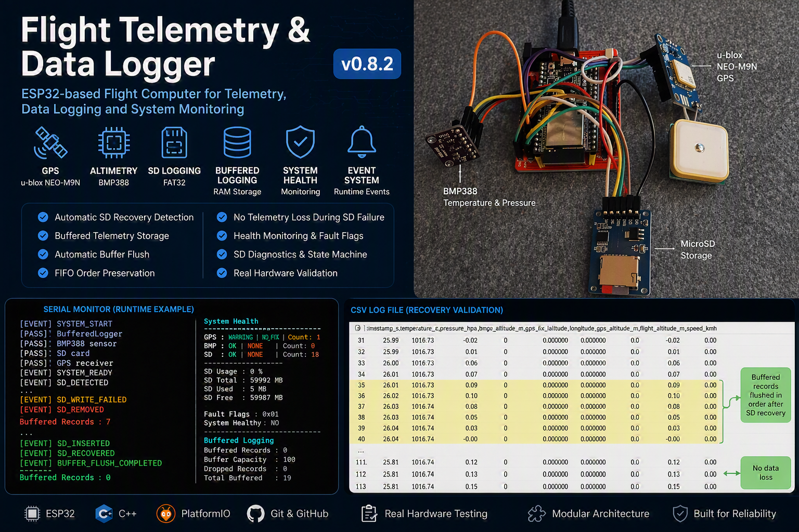
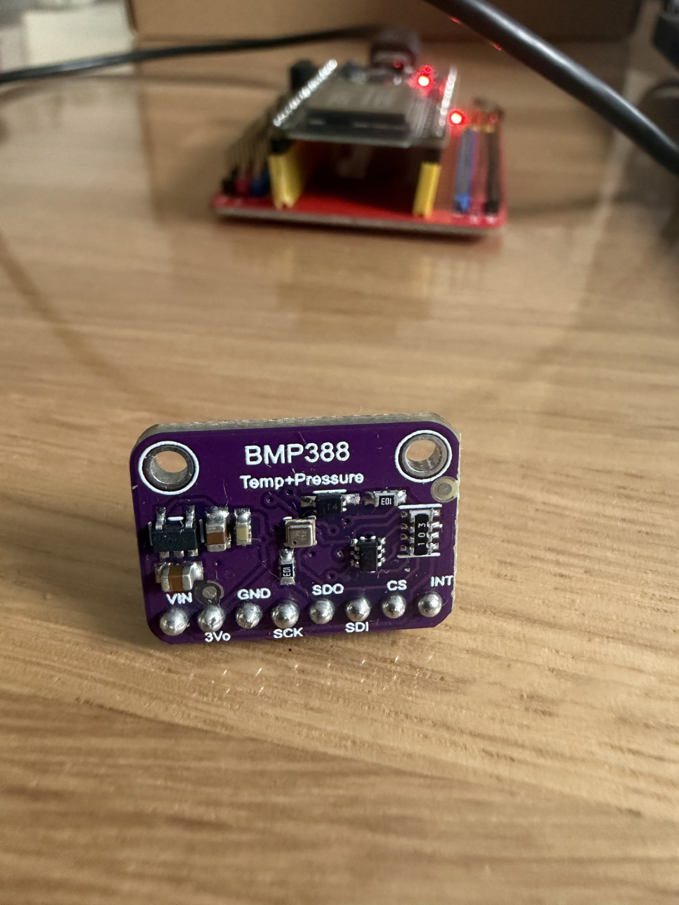
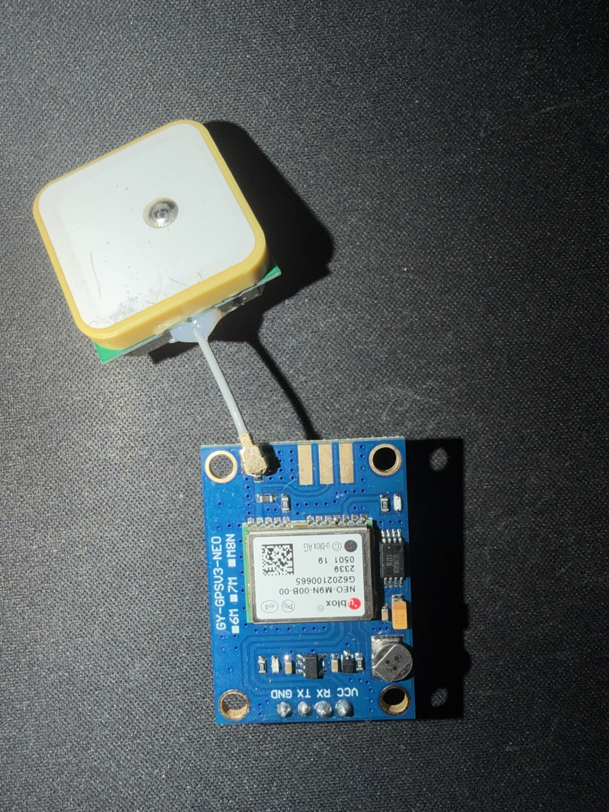
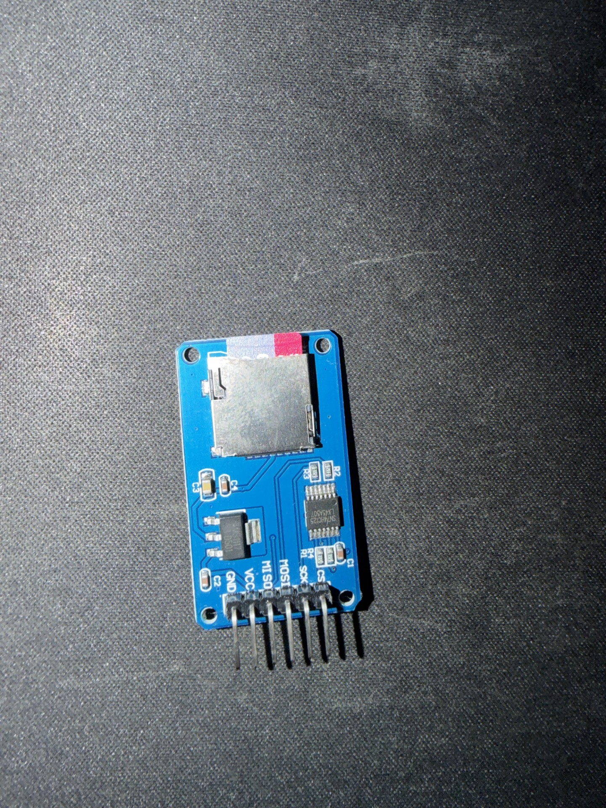
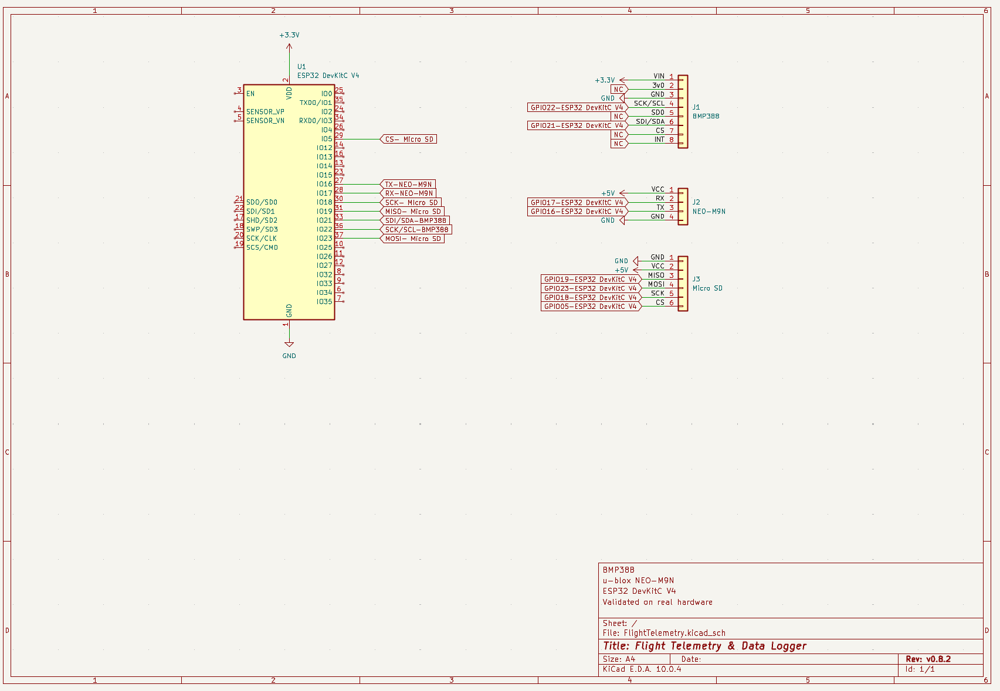

# 🚀 Flight Telemetry & Data Logger

> ESP32-based flight computer featuring GPS telemetry, barometric altitude measurement, runtime diagnostics, health monitoring and fault-tolerant flight data logging.




---

# Overview

Flight Telemetry & Data Logger is a modular ESP32-based flight computer designed for telemetry acquisition, altitude estimation and reliable flight data recording.

The project combines:

- GPS positioning and navigation
- Barometric altitude measurement
- Flight altitude estimation
- CSV data logging
- Runtime health monitoring
- Event-driven diagnostics
- SD card recovery detection
- Buffered telemetry storage
- Automatic buffer flushing
- FIFO-preserved data recovery

All features documented in this repository have been validated on real hardware.

---

# Hardware

The current prototype uses commercial off-the-shelf modules validated during development.

## ESP32 DevKitC V4

Main controller responsible for:

- Sensor acquisition
- Telemetry processing
- Data logging
- Runtime diagnostics
- Health monitoring
- Event management

---

## BMP388 Barometric Sensor



Provides:

- Pressure measurement
- Temperature measurement
- Relative altitude estimation

Configuration:

```text
Interface : I²C

SDA : GPIO21
SCL : GPIO22

Power : 3.3V

CS  : NC
SDO : NC
INT : NC
```

---

## u-blox NEO-M9N GPS Receiver



Provides:

- GPS position
- GPS altitude
- UTC time
- Ground speed

Configuration:

```text
Interface : UART2

TX : GPIO16
RX : GPIO17

Power : 5V
```

---

## MicroSD Storage Module



Used for:

- Flight log storage
- Telemetry recording
- Buffered recovery validation

Configuration:

```text
Interface : SPI

CS   : GPIO5
SCK  : GPIO18
MISO : GPIO19
MOSI : GPIO23

Power : 5V
```

---

# Wiring Diagram

The prototype hardware configuration is documented using KiCad and reflects the validated hardware setup.



---

# System Architecture

```text
ESP32 DevKitC V4
│
├── BMP388Sensor
│
├── GPSSensor
│
├── SDLogger
│
├── BufferedLogger
│
├── SystemHealth
│
├── SystemEvents
│
└── Flight Logger
```

---

# Features

## Telemetry

✅ GPS Position

✅ GPS Altitude

✅ Ground Speed

✅ UTC Time Acquisition

✅ GPS Timestamp Generation

---

## Altitude System

✅ BMP388 Pressure Measurement

✅ BMP388 Temperature Measurement

✅ Relative Altitude Calculation

✅ Flight Altitude Estimation

✅ GPS Speed Deadband Filtering

---

## Logging

✅ Automatic CSV Logging

✅ FAT32 Support

✅ GPS-Based Filenames

✅ Fallback Filenames

✅ Session-Based Recording

✅ Buffered Logging

✅ Automatic Buffer Flush

✅ FIFO Order Preservation

✅ Automatic Recovery After SD Reinsertion

---

## Reliability

✅ Power-On Self Test (POST)

✅ Runtime Health Monitoring

✅ Fault Flags

✅ Error Counters

✅ Runtime Event System

✅ SD Diagnostics

✅ SD State Machine

✅ SD Removal Detection

✅ SD Recovery Detection

✅ Fault-Tolerant Logging

✅ No Telemetry Loss During SD Recovery

---

# Runtime Event System

Supported events:

```text
SYSTEM_START
SYSTEM_READY

GPS_DETECTED
GPS_LOST

GPS_FIX_ACQUIRED
GPS_FIX_LOST

SD_DETECTED

SD_WRITE_FAILED
SD_REMOVED
SD_INSERTED
SD_RECOVERED

BUFFER_FLUSH_COMPLETED
```

Example:

```text
[EVENT] SD_WRITE_FAILED
[EVENT] SD_REMOVED

...

[EVENT] SD_INSERTED
[EVENT] SD_RECOVERED
[EVENT] BUFFER_FLUSH_COMPLETED
```

---

# Flight Altitude Model

The project combines two independent altitude sources.

```text
Flight Altitude

=
GPS Reference Altitude
+
BMP388 Relative Altitude
```

Example:

```text
Takeoff Altitude : 123.4 m

Climb            : +150.0 m

Flight Altitude  : 273.4 m
```

---

# Flight Logging

## File Naming

When GPS FIX is available:

```text
flight_YYYY-MM-DD_HH-MM-SS.csv
```

Example:

```text
flight_2026-07-11_23-01-48.csv
```

Fallback:

```text
flight_boot_001.csv
```

---

## CSV Format

```csv
timestamp_s,
temperature_c,
pressure_hpa,
bmp_altitude_m,
gps_fix,
latitude,
longitude,
gps_altitude_m,
flight_altitude_m,
speed_kmh
```

---

# Validation Status

Validated on real hardware:

✅ POST Validation

✅ Startup without GPS

✅ Startup without BMP388

✅ Startup without SD

✅ Runtime GPS Detection

✅ Runtime GPS Loss Detection

✅ GPS Detection Timeout

✅ GPS Stale Data Timeout

✅ GPS Fix Timeout

✅ GPS Speed Deadband

✅ SD Diagnostics

✅ SD State Machine

✅ SD Write Failure Detection

✅ SD Removal Detection

✅ SD Recovery Detection

✅ Recovery Statistics

✅ Fault Flags

✅ Error Counters

✅ Health Monitoring

✅ Buffered Logging

✅ Automatic Buffer Flush

✅ FIFO Recovery Validation

✅ No Telemetry Loss During SD Failure

---

# Buffered Logging Validation

Scenario:

```text
SD card removed during active logging

↓

Telemetry stored in RAM buffer

↓

SD card reinserted

↓

Automatic flush executed

↓

Buffered records written to CSV

↓

Buffer returns to zero
```

Validated:

```text
✅ Automatic SD Recovery

✅ Automatic Buffer Flush

✅ FIFO Order Preservation

✅ No Telemetry Loss
```

---

# Current Status

Release:

```text
v0.8.2
```

Completed:

```text
ESP32 Bring-Up

BMP388 Integration

GPS Integration

TinyGPSPlus Integration

SD Logging

Power-On Self Test

Health Monitoring

Runtime Event System

Fault Flags

Error Counters

SD Diagnostics

SD State Machine

GPS Runtime Detection

GPS Startup Detection

SD Recovery Detection

Buffered Logging

Automatic Buffer Flush

FIFO Recovery Validation
```

---

# Planned Features

```text
Flight Analytics

LoRa Telemetry

Ground Station Dashboard

INA219 Power Monitoring

Battery Telemetry

FreeRTOS Architecture
```

---

# Roadmap

## v0.9.x

```text
Flight Analytics

Maximum Altitude
Maximum Speed
Flight Duration
Vertical Velocity
```

---

## v1.0

```text
LoRa Telemetry

Ground Station

Real-Time Data Transmission
```

---

## Future

```text
INA219 Power Monitoring

FreeRTOS Migration

Task Separation

Telemetry Queues
```

---

# Project Structure

```text
flight-telemetry-data-logger
│
├── include
│
├── lib
│   ├── BMP388Sensor
│   ├── GPSSensor
│   ├── SDLogger
│   ├── BufferedLogger
│   ├── SystemHealth
│   └── SystemEvents
│
├── src
│
├── docs
│   ├── images
│   │   ├── banner.png
│   │   ├── BMP388.png
│   │   ├── M9N.png
│   │   └── microsd.png
│   │
│   ├── schematics
│   │   └── flighttelemetry-v082.png
│   │
│   └── TestReport_Sprint8.md
│
└── README.md
```

---

# Privacy

All coordinates, timestamps and telemetry samples shown in this repository are synthetic examples or validation data and should not be considered representative of real locations.

---

# License

MIT License